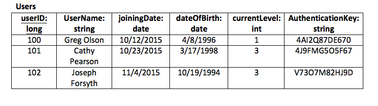
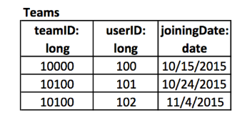
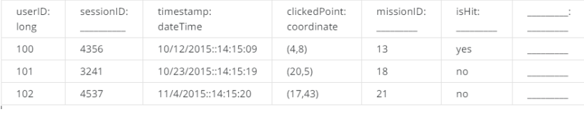
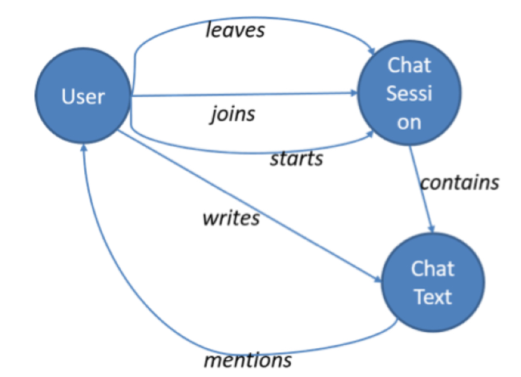
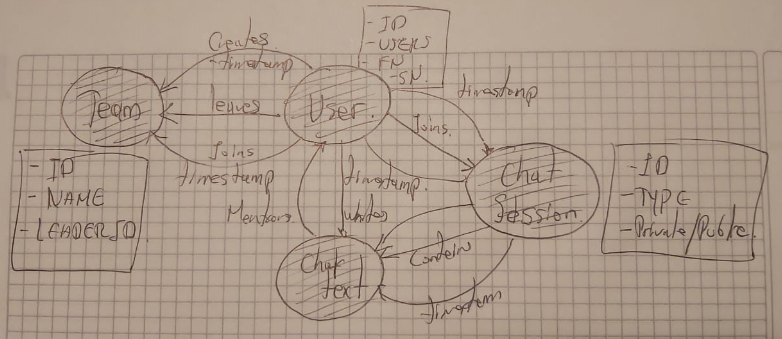
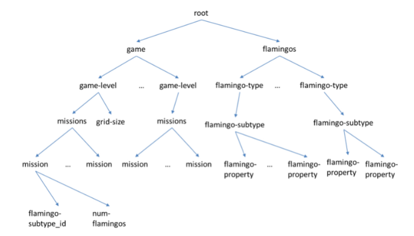

# Designing a Data Model for 'Catch the Pink Flamingo'
### Date: June 1, 2020 

## 1. introduction

The project to develop is oriented in the analysis of a work scenario of a fictional online game called "Catch the Pink Flamingo".

One of the products of an imaginary company Eglence Inc. is a very popular mobile game called "Catch the Pink Flamingo". The objective of the game is to catch as many Pink Flamingos as possible by following the missions provided by the real-time directions in the game and covering the map provided for each level. Levels become more complicated at higher speed within the mission and complexity of the map as users move from one level to another.

It is a multi-user game in which players have to catch Pink Flamingos appearing randomly on a grid map of the world based on missions that change in real time. For the player or team to advance to the next level of complexity, they must have at least one point in each cell of the map grid, that is, cover the entire world map.

## 2. Synopsis

The goal of this assignment is to design the data structures required for creating the game. Remember, that there are three aspects of the game:

1.Designing the data required to run the game

2.Keeping track of what is going on when people are actually playing the game, and

3.Analyzing how people played past games so that we can improve the way the game is played

With this in mind, let us list what we would need.

First, the game will have users, i.e., the players and we need to know some details about them. This information will typically be a relational table that may look like this.

Users ( userID:longInteger, userName:string, joiningDate:date, dateOfBirth:date, currentLevel:int, authenticationKey:string )

Diagrammatically, this would look like:

where userID is underlined because it is a primary key for this relation.

We also know that users would form teams. However, these teams would possibly grow and shrink with time. But it is reasonable to assume that one user will be a part of only one team at any time, and unless we know that the user joined another team more recently, the user belongs to the team she joined last. We can also model teams as relations, which might look like this:

With this table we should be able to determine the members of a team at any point in time, and track how a user has changed teams over time. Remember that a level 1 user will not appear in this table.

For this assignment, we will present incomplete specifications for a few data structures and your task will be to complete them.

## Presentation Part I

We will need a table to keep track of user clicks. Below is a rough structure of the table, but it is incomplete in the following ways:

1.There are no primary keys

2.More columns may need to be added

3.The data types are not all specified.

Copy the table below, paste it into your response, and complete the missing parts of the schema according to the list above. You may provide a brief explanation as needed.

### RTA/=

1.Primary keys are user ID and session attribute ID. There is a foreign key in the missionID field that points to the mission table with the content displayed.

2. The Score Rating column (int) must be added.

3.The attribute of the session ID is long, because it has high speed growth capacity. The MissionID int attribute should be more than enough because there are few missions which limits the game. For the isHit field there are two options: ENUM with input allowed yes or no or just string.

Next, we will see the data of the chat. We know that users can chat when discussing their team's strategy or when deciding whether a new player should join a team. This can be modeled as a graph, as shown below.

Completing graph

The nodes of the graph are entities and the edges are actions they take and the content of the chat. When this graph is populated, we need to include a number of properties to the nodes and edges (recall the lecture covering the property graph model). For example, each action edge should have a timestamp attribute to indicate when the action occurred. Using this graph, we should be able to analyze different types of questions.

List all node and edge properties for a graph.

Briefly explain how you would use the graph to answer the following five questions?

Which teams are having more conversations?
Do users chat more (or less) before they leave a team?
What are the dominant terms (words) used in a chat session within a specific time period?
Which users are most active in a specific chat session?
How many chat sessions is a user participating in at the same time?

The following questions will be answered below:

1. Which teams are having more conversations?
##### RTA/=
Presumably, the conversations correspond to the session of a chat, a new one creates a new session that in this case could calculate the number of nodes between users and chat sessions with grouping.

2.Do users chat more (or less) before they leave a team?
##### RTA/=
There is a relationship between the user and the team that determines the occurrence of each action, although you can build a graph that calculates the average of texts written in a day in the chat comparing its increase or decrease.

3.What are the dominant terms (words) used in a chat session within a specific time period?
##### RTA/=
Tokenized text filter of text chat within a desired period and between user nodes and text chat, then you could list this information in the box to perform some analysis.

4.Which users are most active in a specific chat session?
##### RTA/=
It is understood that the most active user is the one who connects the most and the one who writes the most chat messages and calculates the number of times relating the user variable and the text chat identified with the session id

5.How many chat sessions is a user participating in at the same time?
##### RTA/=
Calculating the number of chat sessions from a moment in time and the relationship between user and session, contacting the number of units.

## Presentation Part II

We will need to design the structure of the game itself. We will use the following partially specified semistructured data object.

We have seen that both XML and JSON are essentially trees. The tree here says that the “missions” category can have several “mission” items. Each mission item will have an associated flamingo type (e.g., flamingos with stars on their backs) and the number of flamingos of that type released to the users to catch. We also have flamingos of different types and subtypes, where each subtype will have a list of properties.

Explain how you might extend the tree with at least five specific flamingo properties. For example, beak-color whose values might be “bright-red” or “pink”.

Your objective is to make sure the tree has enough properties to launch the game and connect with the three data structures we have used so far.

### RTA/=

Flamingo Properties:

1.flamingoName (string) ex. "Real Flaming"

2.beakColor (string) ex. pink, red, black...

3.plumeColor (string) ex. pink, red, black...

4.legsColor (string) ex. pink, yellow, white

5.dim (tuples of int, one for X and one for Y)

6.catchingFoods (list of string)

7.life (int, the number of hits for catch)

8.scoreHit (int) ex. from 1 to 10 or 20.